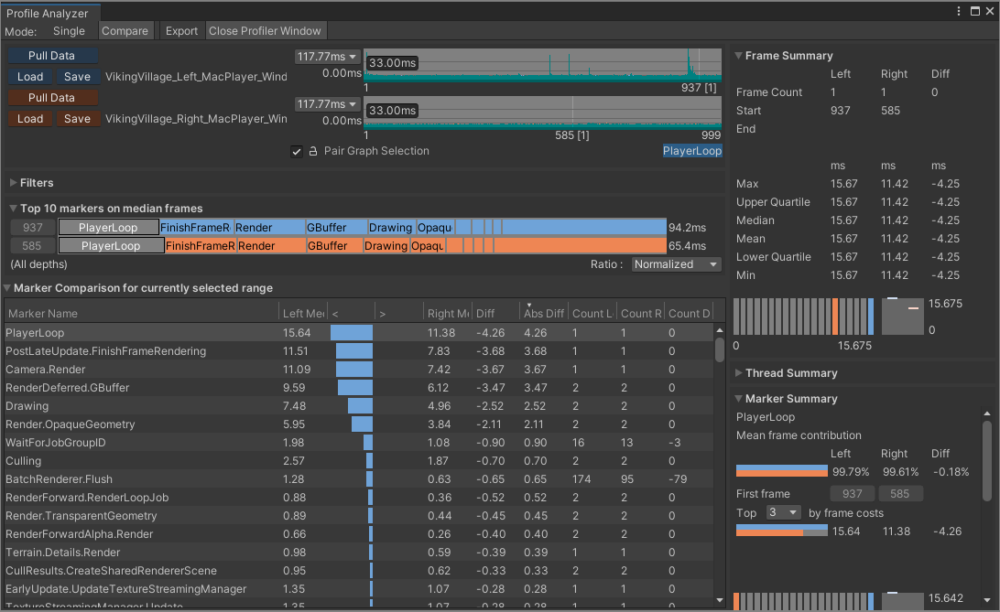

# Comparing frames from different data sets

This workflow explains how to compare two frames from different data sets. In this example, it shows how to compare the median frames from each data set. Comparing the median frames helps you understand what might be happening in a frame that is central to the distribution for each data set. 

## Step 1: Collect performance data to analyze

1. Open the Profile Analyzer window (menu: **Window &gt; Analysis &gt; Profile Analyzer**). Click the **Compare** button in the toolbar to enter the Compare view.
1. Collect some profiling data. To pull data from an active profiling session, click the **Pull Data** button. This pulls in the current set of available frames from the Profiler. If you don't have an active profile session, click the **Open Profiler Window** button, then load or record some data. For more information on how to collect data, see the workflow documentation on [Collecting and viewing data](collecting-and-viewing-data.md).
1. Pull a different data set that you want to analyze into each graph in the [Frame Control](frame-range-selection.md) pane.

## Step 2: Select frames of interest

Enable **Pair Graph Selection**. Right-click on one of the graphs in the Frame Control pane and then choose **Select Median Frame** from the context menu.

The Profile Analyzer then analyzes the two median frames of the data sets like this:

You can then look further and compare the differences between the median frames of each data set.

For further information, see the [Ordering frames by length](ordering-frames-by-cost.md) workflow, which extends the selected range and number of frames used from the middle of the frame distribution.
