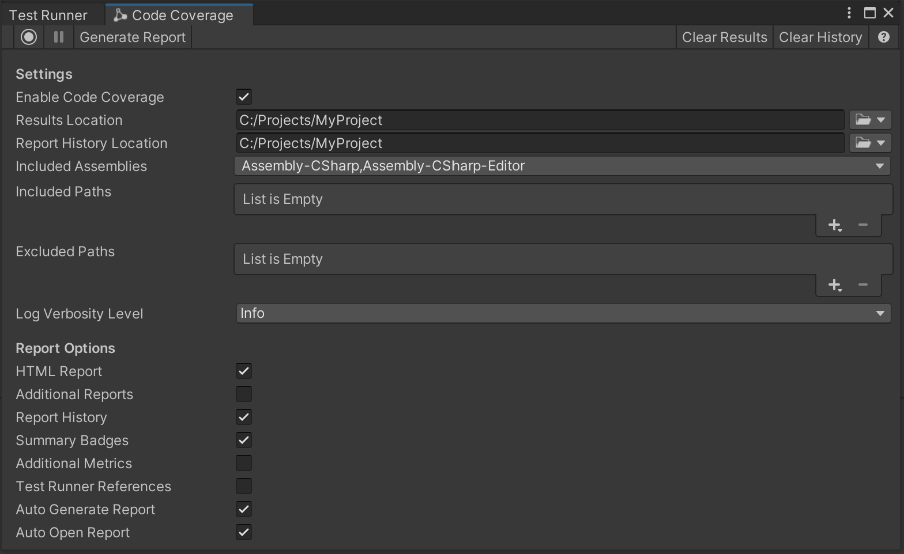

# Code Coverage window

|**Toolbar**|**Description**|
|:---|:---|
||Select **Start Recording** to start recording code coverage data and **Stop Recording** to stop recording.|
||Select **Pause Recording** to pause recording code coverage data and **Resume Recording** to resume recording. The buttons are disabled if not in a [Coverage Recording](CoverageRecording.md) session.|
|Generate Report|Select **Generate Report** to generate a coverage report from the last set of tests that were run in the [Test Runner](CoverageTestRunner.md) or from the last [Coverage Recording](CoverageRecording.md) session. Note that **Generate Report** is disabled if no tests ran, there is no Coverage Recording data or all **HTML Report**, **Additional Reports** and **Summary Badges** checkboxes are unchecked.|
|Clear Results|Select **Clear Results** to clear the coverage data from previous test runs or from previous [Coverage Recording](CoverageRecording.md) sessions. **Clear Results** is disabled if the coverage results are cleared, if no tests ran, or if there is no Coverage Recording data.|
|Clear History|Select **Clear History** to clear the coverage report history. **Clear History** is disabled if the history is cleared or if no reports were generated.|
||Select **Help** to open the Documentation Reference for Code Coverage in the web browser.|
|**Settings**|**Description**|
|Enable Code Coverage|Check this to enable Code Coverage. This is required in order to generate Coverage data and reports. Note that Code Coverage can affect the Editor performance.|
|Results Location|Select the dropdown to open or specify the folder where the coverage results and report are saved to, and to reset to the default location. The default location is the Project's folder.|
|Report History Location|Select the dropdown to open or specify the folder where the coverage report history is saved to, and to reset to the default location. The default location is the Project's folder.|
|Included Assemblies|Specify assemblies to be included in the coverage results. This is a dropdown list containing the available assemblies. Click the dropdown to view, select or deselect the assemblies. Select **All** to select all the assemblies in the project. Select **Assets** to select only the assemblies under the `Assets` folder. Select **Packages** to select only the Packages' assemblies. Select **Deselect All** to deselect all the assemblies.  **Note:** If searching, the buttons will apply only to the assemblies visible in the list.|
|Included Paths|Select **Add (+)** to specify individual folders and files to include in coverage results. You can use globbing to filter the paths. If the list is empty, Unity includes all files in the **Included Assemblies**. To remove an individual list entry, select the entry and then select **Remove (-)**.|
|Excluded Paths|Select **Add (+)** to specify individual folders and files to exclude from coverage results. You can use globbing to filter the paths. To remove an individual list entry, select the entry and then select **Remove (-)**.|
|Log Verbosity Level|Click the dropdown to set the verbosity level for the editor and console logs. The default level is `Info`.  **Levels:** `Verbose` All logs will be printed. `Info` Logs, Warnings and Errors will be printed. `Warning` Warnings and Errors will be printed. `Error` Only Errors will be printed. `Off` No logs will be printed.|
|**Report Options**|**Description**|
|HTML Report|Check this to generate an [HTML report](HowToInterpretResults.md).|
|Additional Reports|Check this to generate [SonarQube](https://docs.sonarqube.org/latest/analysis/generic-test), [Cobertura](https://cobertura.github.io/cobertura) and [LCOV](https://github.com/linux-test-project/lcov) reports.|
|Report History|Check this to generate and include the coverage history in the HTML report.|
|Summary Badges|Check this to generate coverage summary badges in SVG and PNG format.|
|Additional Metrics|Check this to generate and include additional metrics in the HTML report. These currently include Cyclomatic Complexity and Crap Score calculations for each method. See the [Risk Hotspots](HowToInterpretResults.md#risk-hotspots) section for more information.|
|Test Runner References|Check this to include test references to the generated coverage results and enable the [Coverage by test methods](HowToInterpretResults.md#coverage-by-test-methods) section in the HTML report. This shows how each test contributes to the overall coverage.|
|Auto Generate Report|Check this to generate the report automatically after the [Test Runner](CoverageTestRunner.md) finishes running or the [Coverage Recording](CoverageRecording.md) session is complete.|
|Auto Open Report|Check this to open the coverage report automatically after it has been generated.|
