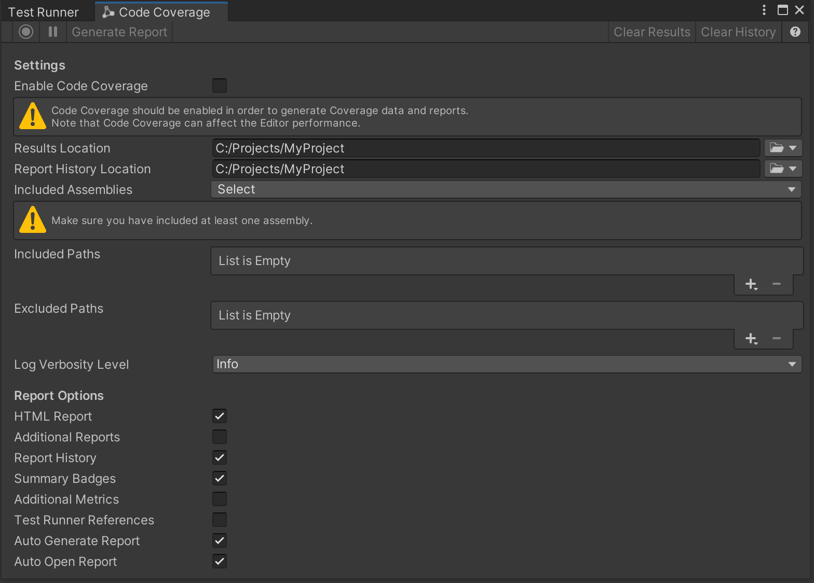
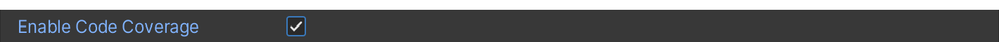
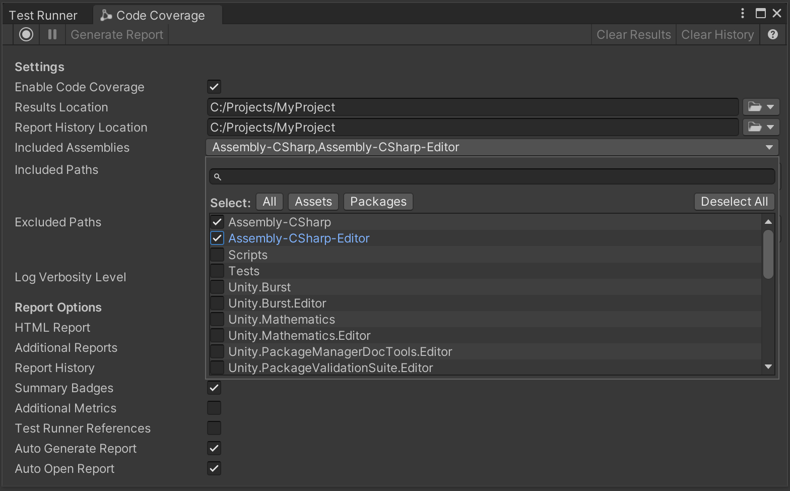
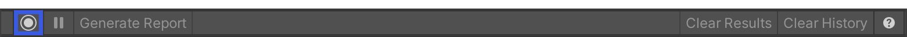
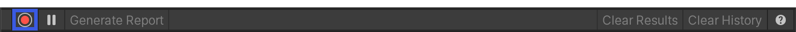
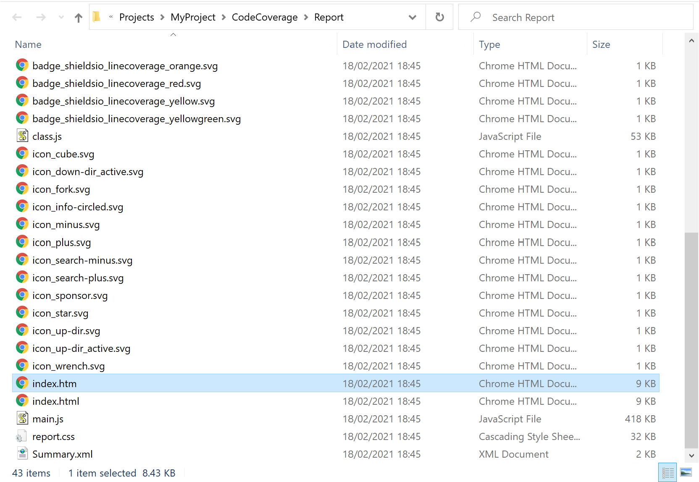
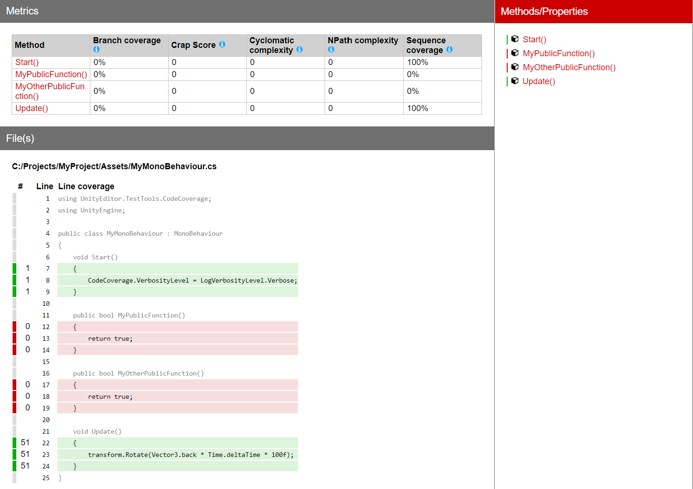

# On-demand coverage recording

With Coverage Recording you can capture coverage data on demand and generate an [HTML report](HowToInterpretResults.md) which shows which lines of your code run while recording. It supports capturing in EditMode as well as in PlayMode, and you can switch between the two.

To start recording coverage data, select **Start Recording**. While recording, use the Editor as usual, for example to enter PlayMode. To stop recording coverage data, select **Stop Recording**. If **Auto Generate Report** is checked, then an [HTML report](HowToInterpretResults.md) is generated and a file viewer window opens (if **Auto Open Report** is checked too). It contains the coverage results and the report. Otherwise, select **Generate Report** to generate the report. The results are based on the assemblies specified in **Included Assemblies**.

You can also control Coverage Recording via the [CodeCoverage ScriptingAPI](https://docs.unity3d.com/Packages/com.unity.testtools.codecoverage@latest/index.html?subfolder=/api/UnityEditor.TestTools.CodeCoverage.CodeCoverage.html).

## Steps

1. Open the [Code Coverage window](CodeCoverageWindow.md) (go to **Window** > **Analysis** > **Code Coverage**).  

2. Select **Enable Code Coverage** if not already selected, to be able to generate Coverage data and reports. 
 **Note:** Enabling Code Coverage adds some overhead to the Editor and can affect the performance.

3. Select the [Assembly Definitions](https://docs.unity3d.com/Manual/ScriptCompilationAssemblyDefinitionFiles.html) you would like to see the coverage for. In this example we selected `Assembly-CSharp` and `Assembly-CSharp-Editor`. By default, Unity compiles almost all project scripts into the `Assembly-CSharp.dll` managed assembly and all Editor scripts into the `Assembly-CSharp-Editor.dll` managed assembly.  

4. Select **Start Recording**. 
 

5. Continue using the Editor as normal, for example enter PlayMode to test your application or run some manual testing. You can also select **Pause Recording** to pause recording and **Resume Recording** to resume recording.

6. When you have finished your testing and have collected enough coverage data, select **Stop Recording**. 

7. If **Auto Open Report** is checked a file viewer window opens containing the coverage report. Alternatively, select the **Results Location** dropdown to open it in the file viewer.  **Note:** To generate the report automatically after you stop recording, select **Auto Generate Report** in the [Code Coverage window](CodeCoverageWindow.md). Alternatively, you can select **Generate Report**. 

8. Select `index.htm`.  

9. This opens the [HTML coverage report](HowToInterpretResults.md).  

