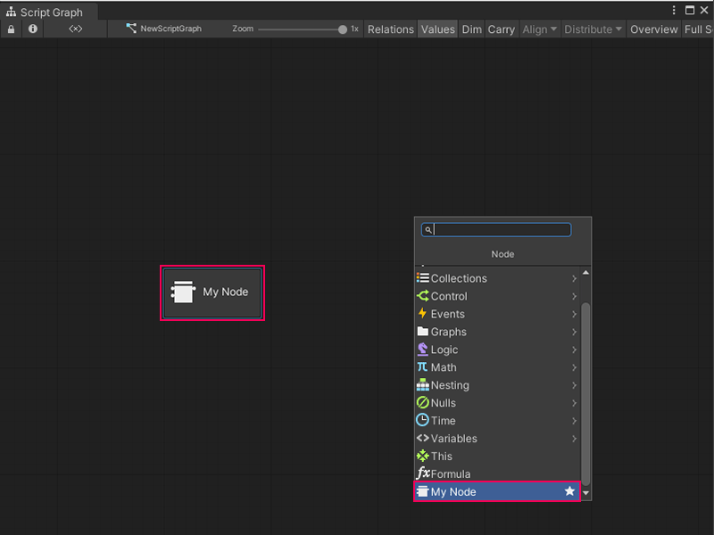

# Create a new simple Custom C# node 

You can create a Custom C# node to run your own custom logic in a Script Graph. For more information on Custom C# nodes, see [Custom C# nodes](vs-create-custom-node.md).

To create a new simple Custom C# node: 

1. [!include[open-project-window](./snippets/vs-open-project-window.md)]

2. Right-click a folder in the Project window's folder list, or anywhere in the Project window's preview pane, and go to **Create** &gt; **C# Script**. 

3. Enter a name, such as `MyNode`, for the new script file. 

1. Press Enter. 

4. [!include[open-new-external-code](./snippets/vs-open-new-external-code.md)]

5. In your external editor, copy and paste the following code into your C# script: 

   ```C#
   using Unity.VisualScripting;
   using UnityEngine;
   
   public class MyNode : Unit
   {
      protected override void Definition() //The method to set what our node will be doing.
      {
      }
   }
   ```

6. [!include[save-script](./snippets/vs-save-script.md)] 

1. [!include[return-unity](./snippets/vs-return-unity.md)]

7. [!include[regen-node-library](./snippets/vs-regen-node-library.md)]

   > [!NOTE]
   > If you don't regenerate your Node Library, the node won't appear in Visual Scripting's fuzzy finder. 

8. [Open a Script Graph](vs-open-graph-edit.md) where you want to add your new node. 

9. [!include[open-fuzzy-finder](./snippets/vs-open-fuzzy-finder.md)] 

1. The node appears as `My Node` at the end of the fuzzy finder list. Select the node to add it to your graph. 

   

## Next steps 

After you create the basic start to a node and add it to Visual Scripting's fuzzy finder, [add ports](vs-create-custom-node-add-ports.md) so your node can send and receive data. 
