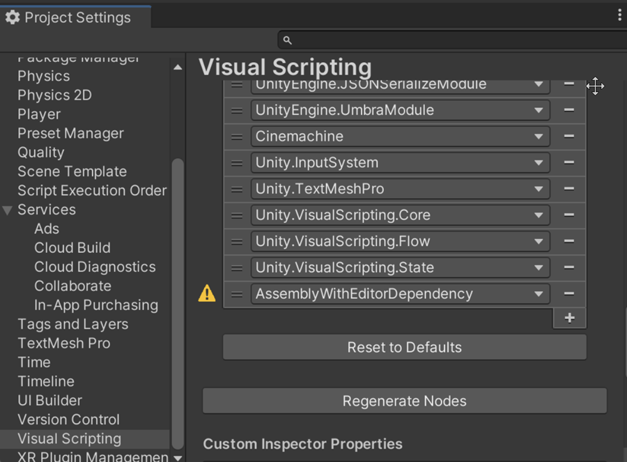

# Known Issues: Unity Editor script functions

If you use nodes that use Unity Editor script functions in any of the Visual Scripting graphs in your project, it causes errors when you try to build your project.

## Cause of the build errors

Unity Visual Scripting (UVS) doesn't support preprocessor directives, so the use of Unity Editor script functions within graphs isn't possible. However, these functions can appear as node options within UVS because UVS uses C# reflection to generate nodes for your project based on your included assemblies. If you add one of these Unity Editor script nodes to a graph that's used in a build of your project, Unity generates an error when it attempts to build the project. An error message of the following format is displayed in the Unity Console: 

`/<ProjectPath>/<CSharpFile>.cs: error CS0103: The name '<MissingApiName>' does not exist in the current context.`

The following code sample is an example of preprocessor directives for Unity Editor scripts :
```
#if UNITY_EDITOR
public static List<Type> GetAllVolumeComponents()
{
    // TypeCache is only accessible in UnityEditor.
    // If you instantiate a GetAllVolumeComponents node in a graph
    // it prevents the project from being built. 
    return TypeCache.GetTypesDerivedFrom<VolumeComponent>().ToList();
}
#endif
```

## Find flagged packages

Packages that contain editor scripts are flagged with a warning icon in the Node Library section of the Visual Scripting tab in the Project Settings window. 

To find the affected packages, do the following:

1. Go to **Edit** > **Project Settings**.
1. In the Project Settings window, select the **Visual Scripting** tab.
1. On the Visual Scripting tab expand the **Node Library** section. </br>
   A yellow warning flag is displayed next to any affected packages as shown in the following screenshot. 
    

## Resolution 

To resolve this issue, go through your graphs and replace nodes that correspond to the API mentioned in the error message until you find the error no longer occurs.